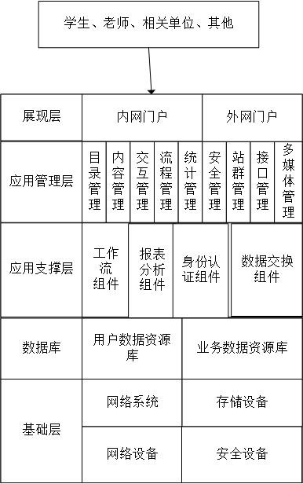
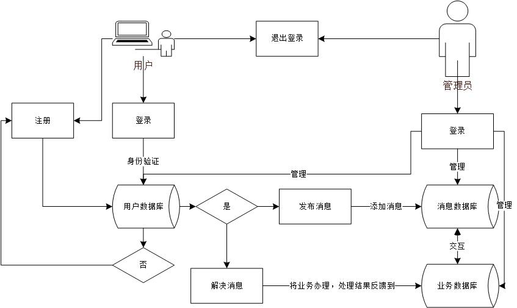

> 编写时尽量使用markdown语法：[https://github.com/younghz/Markdown](https://github.com/younghz/Markdown)or[https://github.com/Love-LG/GitHub-Markdown](https://github.com/Love-LG/GitHub-Markdown)

> <code>fork</code>了本仓库的请先<code>pull new request</code>合并本仓库的的最新内容

目录
* 1.引言 （曾正豪）
  * 1.1. 背景 
  * 1.2. 参考资料 
  * 1.3. 假定和约束 
  * 1.4. 用户的特点 
* 2.功能需求     （李鉴宣&袁超）
  * 2.1. 系统范围 
  
    > 本系统是一个学生服务的平台，致力于学生事务的服务，主要在于发布失物招领信息，将招领信息存储在数据库中，便于保存，提供必要的关键字检索，方便查找招领信息，附属开发学生交易模块，来提供给学生一个发布交易信息的平台。将信息集合到平台，这样信息不凌乱，还方便查找各样的信息。由于市场竞争性很低，所以开放式的立刻投入市场，是不可行的。所以平台先仅限于大学内部使用，用户方面也是仅限于学生。待到用户量大后，就可以将使用范围拓展到多校间使用。
  * 2.2. 系统体系结构（二层架构的系统可剪裁本小节） 
    >在系统的体系结构中：
    
    > 用户层：拥有老师，学生，相关单位，其他访问者。
    
    > 展现层：则是基本的网页，包括内网门户和外网门户。
    
    > 应用层：则包括网页目录，内容管理，数据交互管理，数据及访问统计管理，事务流程的管理，访问安全的管理，接口等方面的管理。
    
    > 应用支撑层：包括必要的工作流组件，处理事务工作、报表分析组件，分析报表、身份认证组件，处理用户访问时的身份认证，用以保证用户登录和数据的安全。
    
    > 数据库层：则用来存储数据，其中包括用户本身的数据，例如：账号，密码，等身份信息；用户发布在平台上的交互数据，例如：存储的失物招领数据，交易信息数据等。
    
    > 基础层：网络设备，系统；存储设备；安全设备。
  * 2.3. 系统总体流程 
  
  
  
  
  * 2.4. 需求分析 
    * 2.4.1. XXXXXXX(功能需求名称) 
      * 2.4.1.1. 功能描述 
      > 本项目主要实现一个信息咨询与展示平台，主要实现的功能有用户的登陆注册、用户的分类、信息的分类、信息的精确检索、用户拥有独立的个人主页、用户可以发布信息、查询信息等。
      * 2.4.1.2. 业务建模 
      * 2.4.1.3. 用例描述 
      > 系统管理员 管理用户和审核信息
      
      > 用户 主要浏览信息、查询信息、发布信息
      * 2.4.1.4. 用户界面 
      > 用户界面主要由网页的形式呈现，在网站首页用户可以浏览到当天最新的信息、用户可以选择不同的分类信息栏查看不同分类信息、用户可以在首页搜索框输入关键字搜索信息。
      
      > 每一个用户拥有自己的个人首页，可以查看到自己发布的所有信息，以及是否被解决状态展示。
    * 2.4.2. XXXXXXX(功能需求名称) 
   
* 3.非功能需求     （邱兴花&李佳）
  * 3.1. 性能要求 
    * 3.1.1. 精度 
    * 3.1.2. 时间特性要求 
    * 3.1.3. 输人输出要求 
		
  * 3.2. 数据管理能力要求 
	
  * 3.3. 安全保密性要求 
	
  * 3.4. 灵活性要求 
	
  * 3.5. 其他专门要求 
* 4.运行环境规定     （洪诚）
  * 4.1. 设备 可有可而要看
* 4.2. 支持软件 
  * 4.3. 接口 
  * 4.4. 控制 
* 5.需求跟踪 （待定）

* 6.签批单  （待定）

> 上述各模块编写参考说明
1. 引言

1.1. 背景

说明： 

a．待开发的软件系统的名称；

b．本项目的任务提出者、开发者、用户及实现该软件的计算中心或计算机网络；

C．该软件系统同其他系统或其他机构的基本的相互来往关系。

1.2. 参考资料 

列出本说明书中引用和参考的资料，如：

a．本项目的经核准的计划任务书或合同、上级机关的批文；

b．属于本项目的其他已发表的文件；

c．本文件中各处引用的文件、资料、包括所要用到的软件开发标准。 列出这些文件资料的标题、文件编号、发表日期和出版单位，说明能够得到这些文件资料的来源。

1.3. 假定和约束[可选]
列出进行本软件开发工作的假定和约束，例如经费限制、开发期限、设备条件、用户的资料准备和交流上的问题等。

1.4. 用户的特点[可选]
列出本软件的最终用户的特点，充分说明操作人员、维护人员的教育水平和技术专长，以及本软件的预期使用频度。这些是软件设计工作的重要约束。

2. 功能需求

2.1. 系统范围 

明确概要地说明用户对系统、产品高层次的目标要求，如系统开发的意图、应用目标、作用范围以及其他相关的背景材料。
如果所定义的产品是一个更大系统的一个组成部分，则应说明本产品与该系统中其他各组成部分之间的关系，为此可使用一张方框图来说明该系统的组成和本产品同其他各部分的联系和接口。

2.2. 系统体系结构（二层架构的系统可剪裁本小节）[可选]
以图+文本结合的方式描述系统的总体架构。
以下应提供系统总体架构图：
以下对系统总体架构进行描述：

2.3. 系统总体流程
以图+文本结合的方式说明系统的总体流程。
图一是计划合同管理系统的总体流程图。
图一

2.4. 需求分析
需求分析的目的是获取或描述系统需求中的每一个功能需求，并通过分析确定系统能够做什么？谁来使用这个系统？
· 建立用例模型：发现角色和用例，并确定角色之间的关系、用例之间的关系，以及角色与用例之间的相互关系
· 描述用例：角色与系统如何交互的规格说明。

2.4.1. XXXXXXX(功能需求名称) 

2.4.1.1. 功能描述

功能编号：
功能需求：从用户业务的角度描述功能需求。

2.4.1.2. 业务建模
从可视化的角度--用例图--描述功能需求
图二是综合计划管理系统合同编辑业务的功能需求用例图。
图二

2.4.1.3. 用例描述
以文本的方式描述每一个用例中角色与系统相互交互的规格说明。

1、 XXXXXX(用例名称)

描述对象 描述内容

标识符 用例的唯一标识符

说明 对用例的概要说明

参与者 与该用例相关的参与者列表，以及参与者的特点

频度 参与者访问此用例的频率

状态 通常分为：进行中、等待审查、通过审查或未通过审查

前置条件 一个条件列表，如果其中包含条件，则这些条件必须在访问用例之前得到满足

后置条件 一个条件列表，如果其中包含条件，则这些条件将在用例成功完成以后得到满足

被扩展的用例 此用例所扩展的用例（如果存在）

被包含的用例 此用例所包含的用例（如果存在）

基本操作流程 参与者在用例中所遵循的主逻辑路径，即当各项工作都正常进行时用例的工作方式
可选操作流程 在变更工作方式、出现异常或发生错误的情况下所遵循的路径

修改历史记录 修改人 ： 修改日期：修改原因：
问题 如果存在，则为与此用例的开发相关的问题或操作项目的列表

以下是综合计划管理系统中的合同编辑功能需求中的合同增加用例描述：
描述对象 描述内容

标识符 IPMS0101

说明 增加一条合同记录

参与者 合同编辑人员--熟悉合同管理业务

频度 

状态 通过审查

前置条件 1. 参与者具有合同增加的权限2. 参与者已选取对应的计划记录3. 当前计划总投资≥SUM(该计划下已签合同价)
后置条件 1. 数据库中更加一条合同纪律2. 可执行合同原件扫描用例3. 可执行合同付款增加用例4. 可执行合同修改和合同删除用例

被扩展的用例 无
被包含的用例 无

基本操作流程 请参见图三的合同增加流程
可选操作流程 当用户确认合同增加时发现异常时，系统提示合同增加无效的提示

修改历史记录 修改人 ： 修改日期：修改原因：
问题 1. 合同编码的具体约定2. 合同类型、资金来源、合同受委托方字典表的具体设计
图三 合同增加活动流程
2、XXXXX(用例名称)
……

2.4.1.4. 用户界面
概要描述功能对应的用户界面风格，采用原型生命周期的项目也可以提供原型界面拷贝。

2.4.2. XXXXXXX(功能需求名称)
……

3. 非功能需求

3.1. 性能要求

3.1.1. 精度[可选]
说明对该软件的输入、输出数据精度的要求，可能包括传输过程中的精度。

3.1.2. 时间特性要求
说明对于该软件的时间特性要求，如对：响应时间；更新处理时间；数据的转换和界面更新传送时间等的要求。

3.1.3. 输人输出要求
解释各输入输出数据类型，并逐项说明其媒体、格式、数值范围、精度等。对软件的数据输出及必须标明的控制输出量进行解释并举例，包括对硬拷贝报告（正常结果输出、状态输出及异常输出）以及图形或显示报告的描述。

3.2. 数据管理能力要求[可选]
说明需要管理的文卷和记录的个数、表和文卷的大小规模，要按可预见的增长对数据及其分量的存储要求做出估算。

3.3. 安全保密性要求
用户对系统所应具备的故障处理能力、处理方式及故障后的系统恢复、数据恢复等要求，对系统防止机密数据被非法侵入、修改及丢失的要求。

3.4. 灵活性要求[可选]
说明对该软件的灵活性的要求，即当需求发生某些变化时，该软件对这些变化的适应能力，如：

a．操作方式上的变化；

b．运行环境的变化；

c．同其他软件的接口的变化；

d．精度和有效时限的变化；

e．计划的变化或改进。

对于为了提供这些灵活性而进行的专门设计的部分应该加以标明。

3.5. 其他专门要求[可选]
如用户单位对使用方便的要求，对可维护性、可补充性、易读性、可靠性、异常处理要求、运行环境可转换性的特殊要求等。

4. 运行环境规定 

4.1. 设备 
列出运行该软件所需要的硬设备。说明其中的新型设备及其专门功能，包括：

a．处理器型号及内存容量；

b．外存容量、联机或脱机、媒体及其存储格式，设备的型号及数量；

c．输入及输出设备的型号和数量，联机或脱机； 

d．数据通信设备的型号和数量；

e．功能键及其他专用硬件

4.2. 支持软件
列出支持软件,包括网络和硬件设备平台、操作系统平台、数据库系统平台以及编译（或汇编）程序和测试支持软件等。

4.3. 接口[可选]
说明该软件同其他软件之间的接口、数据通信协议等。

4.4. 控制[可选]
说明控制该软件的运行的方法和控制信号，并说明这些控制信号的来源。

5. 需求跟踪
需求跟踪的主要目的是保证所有的需求都得到分析，以承诺需求-分析需求对应表（PRS_SRS表）的方式描述已分析需求对已承诺需求的覆盖情况。PRS_SRS表的格式请参见软件需求管理过程规范（SUPL-MANU-SRS-001）。

6. 签批单
